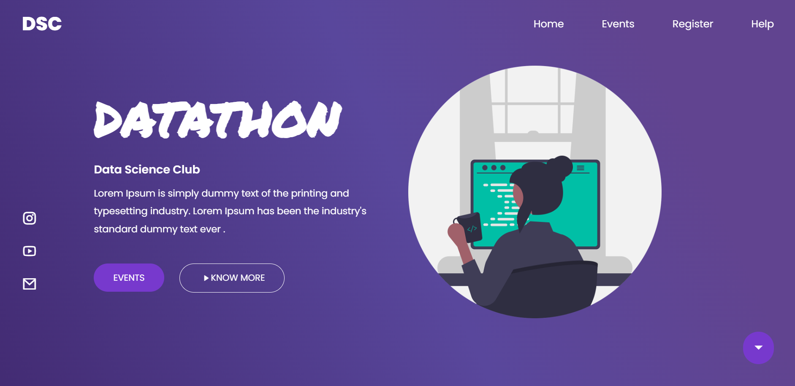

<h1><b>Data Science Club Task 1 Readme</b></h1>

 
<h2><b>Project Overview</b></h2>
 
The Data Science Datathon Frontend Website is a web-based interface designed to provide information about the Data Science Datathon event, including competition rules, prizes, registration, and contact information.
 
The website is built using HTML, CSS, and JavaScript and is intended to be run in a web browser. It can also be served using a web server.

 
<h2><b>Getting Started </b></h2>
 
To run the Instagram follower website , follow these steps:
 
1. Clone the repository onto your local machine using Git. 
git clone https://github.com/devankit57/Data-Science-Club-Task-1.git

2.Run index.html 

 
<b><h2>Application Features</h2></b>

 
The website includes the following features:

1.Gradient Interface  
2.Animation  
3.User Friendly  
4.Responsive design 
5.Smooth Motion 

<b><h2>Screenshot</h2></b>

